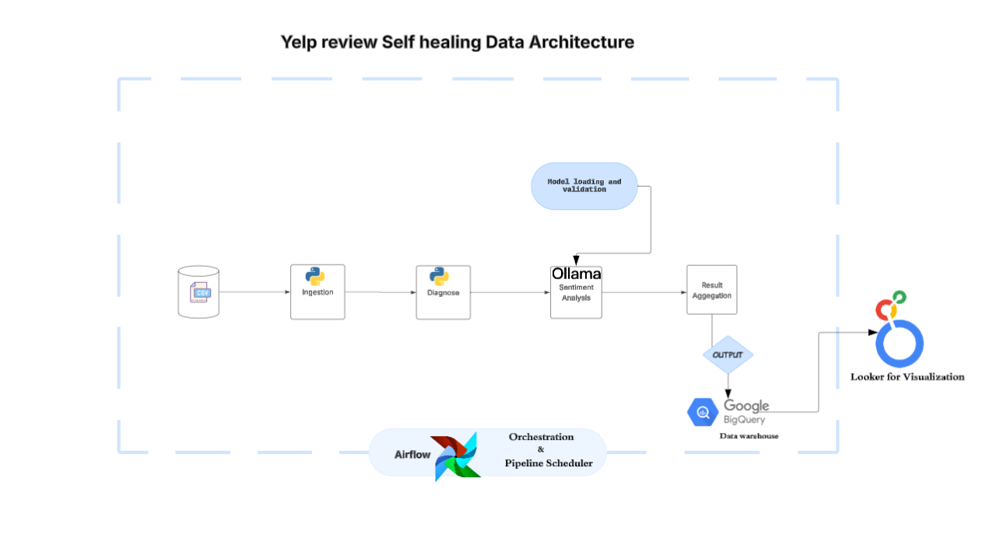

# Self-Healing Sentiment Analysis Pipeline

## Overview

This Apache Airflow DAG implements an intelligent, resilient sentiment analysis pipeline for Yelp review data using OLLAMA language models. The pipeline automatically detects and corrects data quality issues before performing sentiment analysis, ensuring robust processing even with imperfect input data.

### Key Features

- **Self-Healing Data Quality**: Automatically detects and fixes common data quality issues
- **OLLAMA Integration**: Uses local OLLAMA models for sentiment analysis
- **Batch Processing**: Configurable batch sizes for efficient processing
- **Comprehensive Monitoring**: Detailed health reports and metrics
- **Graceful Degradation**: Continues processing even when models fail
- **Star-Sentiment Correlation**: Analyzes the relationship between star ratings and predicted sentiment

---

## Table of Contents

1. [Architecture Overview](#architecture-overview)
2. [Prerequisites](#prerequisites)
3. [Installation](#installation)
4. [Configuration](#configuration)
5. [Pipeline Components](#pipeline-components)
6. [Data Flow](#data-flow)
7. [Self-Healing Mechanisms](#self-healing-mechanisms)
8. [Usage](#usage)
9. [Output Format](#output)
10. [Monitoring & Health Reports](#monitoring--health-reports)
11. [Contribution](#Contribution)

---

## Architecture Overview

The pipeline follows a linear DAG structure with six main tasks:

```
load_model() → load_reviews() → diagnose_and_heal_batch() → 
batch_analyse_sentiment() → aggregate_result() → generate_health_report()
```


### High-Level Flow

1. **Model Loading**: Validates and prepares the OLLAMA model
2. **Data Loading**: Reads reviews from JSON file with offset/batch support
3. **Healing**: Diagnoses and fixes data quality issues
4. **Analysis**: Performs sentiment analysis using OLLAMA
5. **Aggregation**: Compiles results with statistics
6. **Reporting**: Generates health status report

---

## Prerequisites

### System Requirements

- Python 3.12+
- Apache Airflow 3.0+
- OLLAMA server running locally or remotely
- Sufficient disk space for input/output files ()
- 8GB+ RAM recommended for LLM inference

---

## Installation


1. **Clone the repository**
   ```bash
   git clone https://github.com/Echooed/yelpReviewsSelfHealingPipeline.git
   cd yelpReviewsSelfHealingPipeline
   ```

2. **Create virtual environment**
   ```bash
   python -m venv .venv
   source .venv/bin/activate  # On Windows: .venv\Scripts\activate
   ```

3. **Install dependencies**
   ```bash
   pip install -r requirements.txt
   ```
4. **Install OLLAMA**
   - https://ollama.ai
   - Pull a model (default: llama3.2):
   ```bash
   ollama pull llama3.2
   ```

5. **Install Airflow**
 ```bash
   pip install apache-airflow
   pip install ollama
```

6. Ensure OLLAMA server is running:
   ```bash
   ollama serve
   ```

7. **Start Airflow services**
   ```bash
   airflow standalone
   ```

   Or run components separately:
   ```bash
   # Terminal 1: Start webserver
   airflow webserver --port 8080

   # Terminal 2: Start scheduler
   airflow scheduler
   ```

## Configuration

### Environment Variables

| Variable | Default | Description |
|----------|---------|-------------|
| `PIPELINE_BASE_DIR` | Project root | Base directory for the pipeline |
| `PIPELINE_INPUT_FILE` | `input/yelp_academic_dataset_review.json` | Input data file |
| `PIPELINE_OUTPUT_DIR` | `output/` | Output directory |
| `PIPELINE_MAX_TEXT_LENGTH` | `2000` | Max characters per review |
| `OLLAMA_HOST` | `http://localhost:11434` | Ollama server URL |
| `OLLAMA_MODEL` | `llama3.2` | Model for sentiment analysis |
| `OLLAMA_TIMEOUT` | `120` | Request timeout (seconds) |
| `OLLAMA_RETRIES` | `3` | Retry attempts on failure |

### DAG/Runtime Parameters

Override defaults when triggering the DAG:

```python
{
    "input_file": "/path/to/reviews.json",
    "batch_size": 100,
    "offset": 0,
    "ollama_model": "llama3.2"
}
```

---

## Pipeline Components

### 1. Configuration Class (`Config`)

Centralizes all configuration with support for environment variables.

**Key Settings:**
- `BASE_DIR`: Root directory for pipeline files
- `INPUT_FILE`: Path to Yelp reviews JSON
- `OUTPUT_DIR`: Where results are saved
- `MAX_TEXT_LENGTH`: Maximum review text length (default: 3000 chars)
- `OLLAMA_*`: OLLAMA server and model settings

### 2. Model Loading (`load_model()`)

**Purpose**: Validates OLLAMA model availability and functionality

**Process:**
1. Connects to OLLAMA server
2. Checks if model exists locally
3. Pulls model from remote if not found
4. Runs validation test ("classify sentiment of 'This is a great product!'")
5. Returns model metadata

**Output:**
```python
{
    'backend': 'ollama',
    'model_name': 'llama3.2',
    'ollama_host': 'http://localhost:11434',
    'max_length': 3000,
    'status': 'loaded',
    'validated_at': '2025-12-31T10:30:00'
}
```

### 3. Review Loading (`load_reviews()`)

**Purpose**: Efficiently loads reviews in batches from large JSON files

**Process:**
1. Opens input file
2. Uses `itertools.islice` for memory-efficient batch extraction
3. Parses JSON lines
4. Extracts relevant fields
5. Handles malformed JSON gracefully

**Fields Extracted:**
- `review_id`: Unique review identifier
- `business_id`: Business identifier
- `user_id`: User identifier
- `stars`: Star rating (1-5)
- `text`: Review text content
- `date`: Review date
- `useful`, `funny`, `cool`: User engagement metrics

### 4. Diagnosis & Healing (`diagnose_and_heal_batch()`)

**Purpose**: Detects and fixes data quality issues before analysis

**Healing Logic (`_heal_review()`):**

#### Issue Detection & Resolution

| Issue Type | Detection | Action | Result |
|------------|-----------|--------|--------|
| **Missing Text** | `text is None` | Fill with placeholder | `"No review text provided."` |
| **Wrong Type** | `not isinstance(text, str)` | Convert to string | `str(text)` |
| **Empty Text** | `not text.strip()` | Fill with placeholder | `"No review text provided."` |
| **Special Chars Only** | No alphanumeric chars | Replace | `"[Non-text content]"` |
| **Too Long** | `len(text) > MAX_LENGTH` | Truncate | `text[:2997] + "..."` |
| **Valid** | None of above | Clean whitespace | `text.strip()` |

**Output Structure:**
```python
{
    'review_id': 'abc123',
    'business_id': 'xyz789',
    'stars': 4,
    'original_text': 'original content',
    'healed_text': 'cleaned content',
    'error_type': 'too_long',  # or None
    'action_taken': 'truncated_text',
    'was_healed': True,
    'metadata': {...}
}
```

### 5. Sentiment Analysis (`batch_analyse_sentiment()`)

**Purpose**: Performs sentiment classification using OLLAMA

**Process:**

1. **Connection**: Establishes OLLAMA client
2. **Iteration**: Processes each healed review
3. **Prompting**: Sends structured prompt to model
4. **Parsing**: Extracts sentiment and confidence
5. **Retry Logic**: Up to 5 attempts per review
6. **Fallback**: Returns NEUTRAL on failure

**Prompt Template:**
```
Analyze the sentiment of this review and classify it as POSITIVE, NEGATIVE, or NEUTRAL. 
Review: "{text}"
Reply with ONLY a JSON object: {"sentiment": "POSITIVE", "confidence": 0.95}.
```

**Response Parsing (`_parse_ollama_response()`):**

1. Strip markdown code fences (```json)
2. Parse JSON response
3. Validate sentiment label (POSITIVE/NEGATIVE/NEUTRAL)
4. Clamp confidence to [0.0, 1.0]
5. Fallback to keyword matching if JSON parsing fails

**Fallback Logic:**
- If JSON parsing fails, searches response text for sentiment keywords
- Returns default confidence scores (0.75 for found keywords, 0.5 for NEUTRAL)

### 6. Results Aggregation (`aggregate_result()`)

**Purpose**: Compiles comprehensive statistics and saves results

**Calculated Metrics:**

- **Totals**: Total processed, success count, healed count, degraded count
- **Rates**: Success rate, healing rate, degradation rate
- **Distributions**: Sentiment distribution (POSITIVE/NEGATIVE/NEUTRAL)
- **Healing Stats**: Count of each healing action type
- **Star Correlation**: Sentiment breakdown by star rating
- **Confidence Analysis**: Average confidence by status


### 7. Health Report (`generate_health_report()`)

**Purpose**: Assesses pipeline health based on processing outcomes

**Health Status Logic:**

| Condition | Status | Description |
|-----------|--------|-------------|
| Degraded > 10% of total | **CRITICAL** | Many failures in sentiment analysis |
| Degraded > 0 | **DEGRADED** | Some failures occurred |
| Healed > 50% of total | **WARNING** | High data quality issues |
| Otherwise | **HEALTHY** | Normal operation |

**Report Structure:**
```python
{
    'pipeline': 'self_healing_pipeline',
    'timestamp': '2025-12-31T14:30:45',
    'health_status': 'HEALTHY',
    'run_info': {...},
    'metrics': {
        'total_processed': 100,
        'success_rate': 0.85,
        'healing_rate': 0.15,
        'degradation_rate': 0.0
    },
    'sentiment_distribution': {...},
    'healing_summary': {...},
    'average_confidence': {...}
}
```

---

## Data Flow

### Input Format

Reviews must be in JSON Lines format (one JSON object per line):

```json
{"review_id": "abc123", "business_id": "xyz789", "user_id": "user1", "stars": 5, "text": "Great place!", "date": "2024-01-15", "useful": 10, "funny": 2, "cool": 5}
{"review_id": "def456", "business_id": "xyz789", "user_id": "user2", "stars": 1, "text": "Terrible service", "date": "2024-01-16", "useful": 5, "funny": 0, "cool": 0}
```

### Processing States

1. **Raw**: Original review from input file
2. **Healed**: After diagnosis and correction
3. **Analyzed**: After sentiment classification
4. **Aggregated**: Compiled with statistics

### Output
Results are saved to `output/` with timestamped filenames:

```
output/
└── sentiment_analysis_summary_2025-01-03_12-20-00_Offset0.json
```

Output JSON file format example:

```json
{
  "run_info": {
    "timestamp": "2025-12-31T14:30:45.123456",
    "batch_size": 100,
    "offset": 0,
    "input_file": "/path/to/reviews.json"
  },
  "totals": {
    "processed": 100,
    "success": 85,
    "healed": 15,
    "degraded": 0
  },
  "rates": {
    "success_rate": 0.85,
    "healing_rate": 0.15,
    "degradation_rate": 0.0
  },
  "sentiment_distribution": {
    "POSITIVE": 60,
    "NEGATIVE": 25,
    "NEUTRAL": 15
  },
  "healing_statistics": {
    "truncated_text": 8,
    "filled_with_placeholder": 5,
    "type_conversion": 2
  },
  "star_sentiment_correlation": {
    "5": {"POSITIVE": 45, "NEGATIVE": 2, "NEUTRAL": 3},
    "4": {"POSITIVE": 30, "NEGATIVE": 5, "NEUTRAL": 5},
    "3": {"POSITIVE": 10, "NEGATIVE": 8, "NEUTRAL": 12},
    "2": {"POSITIVE": 3, "NEGATIVE": 15, "NEUTRAL": 2},
    "1": {"POSITIVE": 2, "NEGATIVE": 20, "NEUTRAL": 3}
  },
  "average_confidence": {
    "success": 0.87,
    "healed": 0.79,
    "degraded": 0.5
  },
  "results": [
    {
      "review_id": "abc123",
      "business_id": "xyz789",
      "stars": 5,
      "text": "Great place!",
      "original_text": "Great place!",
      "predicted_sentiment": "POSITIVE",
      "confidence": 0.95,
      "status": "success",
      "healing_applied": false,
      "healing_action": null,
      "error_type": null,
      "metadata": {...}
    }
  ]
}
```

---

## Self-Healing Mechanisms

### Design Philosophy

The pipeline follows a **"fail-safe, not fail-fast"** approach:
- **Detect**: Identify data quality issues early
- **Heal**: Apply appropriate corrections
- **Track**: Record all healing actions
- **Continue**: Never halt processing due to bad data
- **Report**: Provide transparency into healing actions

### Healing Strategies

#### 1. Missing Data Handling
- **Problem**: `null` or missing text fields
- **Solution**: Placeholder text insertion
- **Rationale**: Maintains record count, allows analysis to continue

#### 2. Type Coercion
- **Problem**: Non-string text fields (numbers, objects)
- **Solution**: Convert to string representation
- **Rationale**: Preserves potential information content

#### 3. Empty Content
- **Problem**: Whitespace-only or empty strings
- **Solution**: Placeholder insertion
- **Rationale**: Prevents downstream errors

#### 4. Special Characters
- **Problem**: Text with no alphanumeric content
- **Solution**: Replace with marker text
- **Rationale**: Identifies non-text content for review

#### 5. Length Truncation
- **Problem**: Reviews exceeding token limits
- **Solution**: Truncate with ellipsis marker
- **Rationale**: Prevents model timeouts while preserving the beginning of text

### Graceful Degradation

When OLLAMA fails:
1. Retries up to 5 times with exponential backoff
2. Falls back to NEUTRAL sentiment with 0.5 confidence
3. Marks status as "degraded."
4. Continues processing remaining reviews

---

## Usage

### Basic Execution

#### Via Airflow UI

1. Navigate to Airflow UI (http://localhost:8080)
2. Find `self_healing_pipeline` DAG
3. Click "Trigger DAG"
4. Use default parameters or customize
5. Monitor execution in the Graph view


#### Via CLI

```bash
# Trigger with default parameters
airflow dags trigger self_healing_pipeline

# Trigger with custom parameters
airflow dags trigger self_healing_pipeline \
  --conf '{"batch_size": 100, "offset": 0, "ollama_model": "llama3.2"}'
```

### Advanced Usage

#### Process Specific Batch

```python
# Process reviews 1000-1100
{
    "batch_size": 100,
    "offset": 1000
}
```

---

## Monitoring & Health Reports

### Key Metrics to Monitor

#### 1. Success Rate
- **Target**: > 90%
- **Indicates**: Overall pipeline effectiveness
- **Action if low**: Check OLLAMA server health

#### 2. Healing Rate
- **Target**: < 20%
- **Indicates**: Input data quality
- **Action if high**: Review data collection process

#### 3. Degradation Rate
- **Target**: < 5%
- **Indicates**: Model/infrastructure issues
- **Action if high**: Check OLLAMA logs, increase retries

#### 4. Confidence Scores
- **Target**: > 0.75 average
- **Indicates**: Model certainty
- **Action if low**: Consider different model or fine-tuning

### Health Status Interpretation

#### HEALTHY ✅
- All systems are operating normally
- Data quality acceptable
- No intervention needed

#### WARNING ⚠️
- High healing rate (> 50%)
- Data quality issues present
- **Action**: Review data collection/cleaning processes

#### DEGRADED ⚠️⚠️
- Some sentiment analysis failures
- Model or connectivity issues
- **Action**: Check OLLAMA server, logs

#### CRITICAL 🔴
- Many failures (> 10%)
- System malfunction
- **Action**: Stop pipeline, investigate immediately


---


### DAG Parameters

```python
{
    'input_file': str,      # Path to input file
    'batch_size': int,      # Number of reviews per batch
    'offset': int,          # Starting offset in file
    'ollama_model': str     # OLLAMA model to use
}
```

### Review Object Structure

```python
{
    'review_id': str,          # Unique identifier
    'business_id': str,        # Business identifier
    'user_id': str,            # User identifier
    'stars': int,              # Rating (1-5)
    'text': str,               # Review text
    'date': str,               # Review date
    'useful': int,             # Usefulness votes
    'funny': int,              # Funny votes
    'cool': int                # Cool votes
}
```

### Healed Review Structure

```python
{
    'review_id': str,
    'business_id': str,
    'stars': int,
    'original_text': str,      # Original text before healing
    'healed_text': str,        # Text after healing
    'error_type': str,         # Type of issue found (or None)
    'action_taken': str,       # Healing action applied
    'was_healed': bool,        # Whether healing was applied
    'metadata': dict           # Additional metadata
}
```

### Analysis Result Structure

```python
{
    'review_id': str,
    'business_id': str,
    'stars': int,
    'text': str,                    # Final text used for analysis
    'original_text': str,           # Original text
    'predicted_sentiment': str,     # POSITIVE, NEGATIVE, or NEUTRAL
    'confidence': float,            # Confidence score (0.0-1.0)
    'status': str,                  # success, healed, or degraded
    'healing_applied': bool,
    'healing_action': str,
    'error_type': str,
    'metadata': dict
}
```

---


## License


